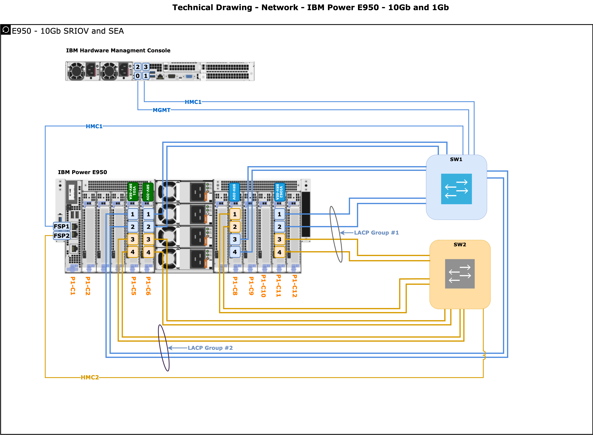

# IBM Architecture Diagrams

Created some IBM HW and software Architecture diagrams in "Diagrams /DrawIO" that can be use on almost all platforms, and there is also a WebBrowser version. 

Diagram.net can import and save content from different sources like, DropBox, GitHub. 
Can also commit directly to GitHub and GitLab  

[Check Out Diagrams Blog](https://www.diagrams.net/blog)

Check also [IBM Architecture Center](https://www.ibm.com/cloud/garage/architectures/edit) 

## Import Guides
 - Open the desktop [Draw.io application](https://github.com/jgraph/drawio-desktop/releases) in your computer or open [app.diagram.net](https://app.diagrams.net/) in your browser.

 - **Direct Links to Online Diagram editor from GitHub Repo**

   - **Block Storage**
     - [IBM FlashSystem - HyperSwap - SAN Fabric Private and Public Diagram](https://app.diagrams.net/#Uhttps%3A%2F%2Fraw.githubusercontent.com%2Folemyk%2Fibm-archt-diagram%2Fmaster%2Fdrawio%2Fstorage%2FIBM_Flashsystem-HyperSwap-SAN-Fabric-Public-Private.drawio)
     - [IBM FlashSystem - HyperSwap - SAN Fabric Private Intercluster](https://app.diagrams.net/#Uhttps%3A%2F%2Fraw.githubusercontent.com%2Folemyk%2Fibm-archt-diagram%2Fmaster%2Fdrawio%2Fstorage%2FIBM_FlashSystem-HyperSwap-SAN-Fabric-Private-Intercluster.drawio)
     - [IBM FlashSystem - SVC Stretched Cluster - SAN Fabric Private and Public Diagram](https://app.diagrams.net/#Uhttps%3A%2F%2Fraw.githubusercontent.com%2Folemyk%2Fibm-archt-diagram%2Fdev%2Fdrawio%2Fstorage%2FIBM_Flashsystem_SVC_SAN_Fabric_Public_Private.drawio)
     - [IBM FlashSystem - FC-Port Connections Diagram ](https://app.diagrams.net/#Uhttps%3A%2F%2Fraw.githubusercontent.com%2Folemyk%2Fibm-archt-diagram%2Fdev%2Fdrawio%2Fstorage%2FIBM_FlashSystem_SVC_FC_Ports_Odd_Even_v2.drawio)
   
   - **File Storage**
     - [IBM Spectrum Scale - Container Native Storage Access](https://app.diagrams.net/#Uhttps%3A%2F%2Fraw.githubusercontent.com%2Folemyk%2Fibm-archt-diagram%2Fdev%2Fdrawio%2Fstorage%2FIBM_Spectrum_Scale_Container_Native_with_storage_cluster_logical.drawio)
     - [IBM Spectrum Scale - Stretched Cluster - CES - Remote Cluster](https://app.diagrams.net/#Uhttps%3A%2F%2Fraw.githubusercontent.com%2Folemyk%2Fibm-archt-diagram%2Fdev%2Fdrawio%2Fstorage%2FIBM_Spectrum_Scale_Stretched_Cluster_CES_Remote.drawio)
   
   - **IBM Power Systems**
      - [IBM Power Systems - Network Connection Drawing](https://app.diagrams.net/#Uhttps%3A%2F%2Fraw.githubusercontent.com%2Folemyk%2Fibm-archt-diagram%2Fdev%2Fdrawio%2Fpower-systems%2FIBM_power_systems_network_drawing.drawio)
   

### User Guide.

Most of the diagrams have layers, So you can remove or add for.example: **FC Ports/Links**

                                                                     
### IBM Storage diagram examples:

#### IBM FlashSystem and SVC - FC-Port Connection Diagram - [IBM FlashSystem - FC-Port Connection Diagram direct link to diagrams.net ](https://app.diagrams.net/#Uhttps%3A%2F%2Fraw.githubusercontent.com%2Folemyk%2Fibm-archt-diagram%2Fmaster%2Fdrawio%2Fstorage%2FIBM_FlashSystem_FC-Ports-Odd-Even.drawio)
**Current System in the diagram**
   - FS9100, FS7100, FS5100, FS5200 and SVC SV*

**Example Flashsystem with Public port.**

- [IBM FlashSystem - FC-Port Connections Diagram ](https://app.diagrams.net/#Uhttps%3A%2F%2Fraw.githubusercontent.com%2Folemyk%2Fibm-archt-diagram%2Fdev%2Fdrawio%2Fstorage%2FIBM_FlashSystem_SVC_FC_Ports_Odd_Even_v2.drawio)

**Example Flashsystem 7200,9100 and 5100 with private and Public port for HyperSwap setup**

- [IBM FlashSystem - FC-Port Connections Diagram ](https://app.diagrams.net/#Uhttps%3A%2F%2Fraw.githubusercontent.com%2Folemyk%2Fibm-archt-diagram%2Fdev%2Fdrawio%2Fstorage%2FIBM_FlashSystem_SVC_FC_Ports_Odd_Even_v2.drawio)

**Example of FlashSystem 5200 with private, (There is also for Private Public / Hypeswap)**

- [IBM FlashSystem - FC-Port Connections Diagram ](https://app.diagrams.net/#Uhttps%3A%2F%2Fraw.githubusercontent.com%2Folemyk%2Fibm-archt-diagram%2Fdev%2Fdrawio%2Fstorage%2FIBM_FlashSystem_SVC_FC_Ports_Odd_Even_v2.drawio)

---

#### IBM FlashSystem - HyperSwap - SAN Fabric Private and Public Diagram

- [IBM FlashSystem - HyperSwap - SAN Fabric Private and Public Diagram](https://app.diagrams.net/#Uhttps%3A%2F%2Fraw.githubusercontent.com%2Folemyk%2Fibm-archt-diagram%2Fmaster%2Fdrawio%2Fstorage%2FIBM_Flashsystem-HyperSwap-SAN-Fabric-Public-Private.drawio)

#### IBM FlashSystem and SVC Stretched Cluster - SAN Fabric Private and Public Diagram

- [IBM FlashSystem - SVC Stretched Cluster - SAN Fabric Private and Public Diagram](https://app.diagrams.net/#Uhttps%3A%2F%2Fraw.githubusercontent.com%2Folemyk%2Fibm-archt-diagram%2Fmaster%2Fdrawio%2Fstorage%2FIBM_Flashsystem-HyperSwap-SAN-Fabric-Public-Private.drawio)

---

#### IBM FlashSystem - HyperSwap - SAN Fabric Private Intercluster Diagram               
                                                                                       
      

- [IBM FlashSystem - HyperSwap - SAN Fabric Private Intercluster](https://app.diagrams.net/#Uhttps%3A%2F%2Fraw.githubusercontent.com%2Folemyk%2Fibm-archt-diagram%2Fmaster%2Fdrawio%2Fstorage%2FIBM_FlashSystem-HyperSwap-SAN-Fabric-Private-Intercluster.drawio)

----

### IBM Power Systems Diagrams

Example with IBM Power E950 network drawing with 10Gb and 1gbps - SRV-IO and SEA - HMC. ( More will come )

 - [IBM Power Systems - Network Drawing](https://app.diagrams.net/#Uhttps%3A%2F%2Fraw.githubusercontent.com%2Folemyk%2Fibm-archt-diagram%2Fdev%2Fdrawio%2Fpower-systems%2FIBM_power_systems_network_drawing.drawio)

----

### IBM Spectrum Scale Diagrams

Example with IBM Spectrum Scale Container Native Storage Access - CSNA

- [IBM Spectrum Scale - CSNA](https://app.diagrams.net/#Uhttps%3A%2F%2Fraw.githubusercontent.com%2Folemyk%2Fibm-archt-diagram%2Fdev%2Fdrawio%2Fstorage%2FIBM_Spectrum_Scale_Container_Native_with_storage_cluster_logical.drawio)

Example with IBM Spectrum Scale Stretched Cluster + CES and Remote Cluster options-  

- [IBM Spectrum Scale - Stretched Cluster - CES and Remote Cluster](https://app.diagrams.net/#Uhttps%3A%2F%2Fraw.githubusercontent.com%2Folemyk%2Fibm-archt-diagram%2Fdev%2Fdrawio%2Fstorage%2FIBM_Spectrum_Scale_Stretched_Cluster_CES_Remote.drawio)

---

### Change Log

**14.04.2021 Updated with:**

- FC Ports for FS9100, FS7100, FS5100, FS5200 and SVC SV*
- IBM FlashSystem with SVC Stretched Cluster including Private and Public Links.
- Spectrum Scale Stretched Cluster with CES and Remote Clusters. 
- IBM Spectrum Scale with CSNA and OpenShift

----
### Contribute if you have drawings you want to share.   
          
To add direct link to diagrams.net, create the URL by copy the raw.githubusercontent url. encode the value as a URL (eg. by using https://jgraph.github.io/drawio-tools/tools/convert.html and clicking URL encode) and add the resulting value after https://app.diagrams.net/#U         

### Notes:
Provides the templates/diagrams "as-is" with no warranty of any kind.